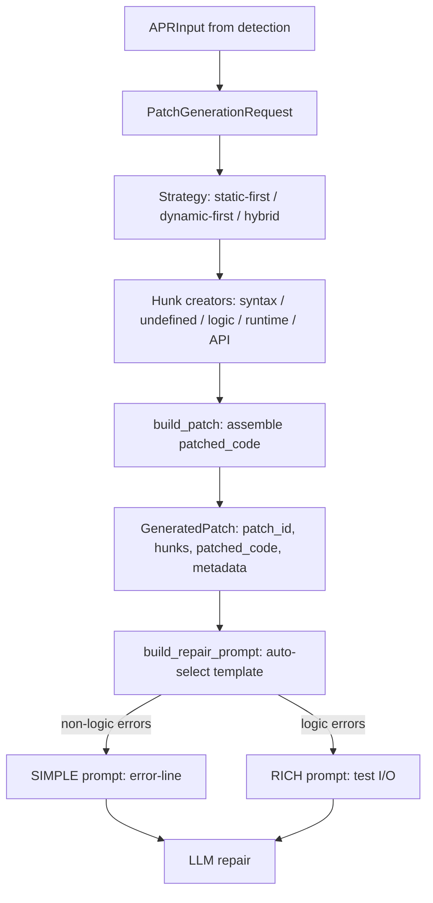

# Patch Generation Module

## Purpose

The **patch generation module** transforms `APRInput` (fault detection results) into structured patch representations with explicit error markers for LLM-based automatic program repair. It uses a **hybrid prompt strategy** to provide optimal context based on error type:

- **Simple prompt** (error-message + error-line) for syntax, runtime, undefined name, API, and missing-return errors
- **Rich prompt** (marked blocks with test I/O) for logic errors (wrong output)

## Hybrid Approach

### Simple Prompt (Error-Line)

**Used for:** `SYNTAX_ERROR`, `UNDEFINED_NAME`, `RUNTIME_ERROR`, `API_ERROR`, `MISSING_RETURN`

**Format:**
```
Fix the error in the code below.

## Error
Line {N}: {error_message}

## Problem
{problem_description}

## Code with Error Marked
[code with conflict-style markers]

## Instructions
- Fix the marked block at line {N}
- Remove all marker lines
- Return the corrected code
```

**Why:** For these error types, the compiler/runtime provides an exact error message and line number. A short, focused prompt is more effective than verbose instructions. The LLM sees "NameError at line 5: name 'x' is not defined" and the marked region—no extra noise.

### Rich Prompt (Test I/O)

**Used for:** `LOGIC_ERROR`, `OFF_BY_ONE`, `TYPE_MISMATCH`, `API_MISUSE`, `MISSING_EDGE_CASE`, etc.

**Format:**
```
Fix the code by resolving all [ERROR START/END] blocks.

## Problem
{problem_description}

## Function Signature
{function_signature}

## Code with Errors Marked
[code with conflict-style markers including TEST/EXPECTED/ACTUAL]

## Instructions
- Replace each block with correct code
- Remove all markers
- Ensure the fixed code passes: [test case summary]
```

**Why:** For logic errors (wrong output), there's no compiler error message—the program ran successfully but produced wrong output. The "error" is the test failure (expected vs actual). So the prompt includes:
- `# TEST: function_call(input)`
- `# EXPECTED: expected_value`
- `# ACTUAL: actual_value`
- `# DIFF: comparison`

This gives the LLM the exact failing input and expected output, which is the right signal for inferring the fix.

## Architecture

### Components

```
APR/patch_generation/
├── schema.py          # Request/response types (PatchGenerationRequest, GeneratedPatch, Hunk)
├── utils.py           # strip_markdown_fences, build_patch, localize_error_by_traceback
├── hunks.py           # Per-error-type hunk creators (create_syntax_hunk, create_logic_error_hunk, etc.)
├── strategies.py      # Patch strategies (static-first, dynamic-first, hybrid)
├── generator.py       # PatchGenerator.generate() - dispatches by strategy and mode
├── validation.py      # validate_patch() - checks marker format
├── prompts.py         # Templates (REPAIR_PROMPT_TEMPLATE, REPAIR_PROMPT_ERROR_LINE) and build_repair_prompt()
└── demo.py            # Runnable demo showcasing both prompt types
```

### Data Flow



### Flow Details

1. **Input:** `PatchGenerationRequest` contains:
   - `apr_input` (APRInput with detection results)
   - `patch_strategy` (mode: single_hunk / multi_hunk / full_replacement; error_focus: static_first / dynamic_first / hybrid)
   - `context_lines` (default: 3)

2. **Strategy execution:**
   - **Static-first:** Prioritize syntax → undefined → missing returns → API errors. Add dynamic hunk if no static errors found and dynamic status != success.
   - **Dynamic-first:** Use dynamic analysis failure to guide patching (assertion_failure → logic hunk, runtime_error → runtime hunk).
   - **Hybrid:** Run static-first, then append dynamic hunk when status != success. (Default and recommended)

3. **Hunk creation:** Each strategy calls hunk creators from `hunks.py`:
   - `create_syntax_hunk`: Marks syntax error region with parser message and hint.
   - `create_undefined_name_hunk`: Marks undefined variable usage with import/definition suggestion.
   - `create_logic_error_hunk`: Marks wrong-output region with TEST/EXPECTED/ACTUAL comments.
   - `create_runtime_error_hunk`: Marks exception region with exception type and message.
   - `create_api_error_hunk`: Marks nonexistent/invalid API usage.
   - `create_missing_return_hunk`: Marks function end where return is missing (heuristic).

4. **Patch building:** `build_patch()` in `utils.py`:
   - Takes hunks (sorted by line_start descending to avoid index shift)
   - For each hunk, replaces the segment `code_lines[line_start:line_end]` with the marker block extracted from `marked_representation`
   - Produces `GeneratedPatch` with `original_code`, `patched_code`, `hunks`, and `metadata` (total_hunks, critical_hunks, strategy_used)

5. **Prompt selection:** `build_repair_prompt()` in `prompts.py`:
   - If `auto_select=True` (default), checks if all hunks have `error_type` in `SIMPLE_ERROR_TYPES` (`{"SYNTAX_ERROR", "UNDEFINED_NAME", "RUNTIME_ERROR", "API_ERROR", "MISSING_RETURN"}`)
   - If yes: uses `REPAIR_PROMPT_ERROR_LINE` with `error_line` and `error_message` from first hunk
   - If no (logic error present): uses `REPAIR_PROMPT_TEMPLATE` with full instructions and test case summary
   - Returns the filled template string for the LLM

6. **Validation:** `validate_patch()` checks:
   - Exactly one START/END pair per hunk
   - Matching error types in START/END markers
   - Original lines present between START and `=======`

## Traceback Wiring

- **Where:** `APR/input/adapters.py` in `current_dynamic_to_dynamic_result()`
- **What:** When the dynamic detection record has `stderr` (e.g. for crash or resource_error), the adapter parses it into a list of lines and populates `failure_details["traceback"]`
- **Effect:** Runtime-error hunks get accurate line numbers via `localize_error_by_traceback()` which extracts "File ..., line N" from the traceback. Syntax and undefined-name errors already have accurate lines from static analysis (parser and AST).

## Usage

### Basic Example

```python
from APR.patch_generation import PatchGenerator, build_repair_prompt

# 1. Build request
request = {
    "apr_input": apr_input,  # APRInput from detection
    "patch_strategy": {
        "mode": "multi_hunk",
        "error_focus": "hybrid",
        "include_suggestions": True,
    },
    "context_lines": 3,
}

# 2. Generate patch
generator = PatchGenerator()
patch = generator.generate(request)

# 3. Build repair prompt (auto-selects simple vs rich)
prompt = build_repair_prompt(apr_input, patch)

# 4. Send prompt to LLM
# repaired_code = your_llm_client.generate(prompt)
```

### Demo

Run the demo to see both prompt types in action:

```bash
cd /path/to/FYP-26
python3 -m APR.patch_generation.demo
```

The demo shows:
- **Syntax error example** → Simple prompt with "Error at line 1: invalid syntax"
- **Logic error example** → Rich prompt with TEST/EXPECTED/ACTUAL and test summary

## Marker Format

All hunks use Git conflict-style markers:

```python
<<<<<<< [ERROR START: ERROR_TYPE]
<original erroneous lines>
=======
<fix suggestion or placeholder>
>>>>>>> [ERROR END: ERROR_TYPE]
```

- Markers at column 0 (no indentation)
- Error type in UPPER_SNAKE_CASE
- Original lines keep their indentation
- For logic errors, fix side includes `# TEST`, `# EXPECTED`, `# ACTUAL`, `# DIFF`
- For other errors, fix side is the error message + line number or a suggestion

The LLM is instructed to replace each block with correct code and remove all markers.

## Key Design Decisions

1. **Hybrid prompt by error type:** Logic errors need test I/O (no compiler message); syntax/runtime/name/API errors benefit from short, focused prompts when the line is accurate.

2. **Same code format, different prompt:** Both paths use the same `patched_code` (with markers). Only the prompt template and wording differ. This keeps code generation simple and consistent.

3. **Traceback for accurate localization:** Wiring stderr into `failure_details.traceback` ensures runtime-error hunks point to the actual failing line (when available), making the simple prompt effective.

4. **Default to hybrid strategy:** Combines static analysis (syntax, undefined, API) with dynamic analysis (test failures) so the patch has the best information from both.

5. **Validation:** All patches are validated before return to ensure markers are well-formed, reducing the chance of confusing the LLM with malformed input.
