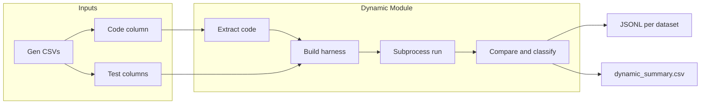

# Dynamic Code Hallucination Detection Implementation

## Context

- **Plan reference**: [Dynamic_Detection_Plan](../../Dynamic_Detection_Plan) defines a 4-step pipeline: code extraction → test harness injection → sandbox execution → oracle comparison/classification.
- **Existing pattern**: Static modules under [Hallucination detection/static/](../static/) (AST, CFG, LIB_API) read from the same Code generation CSVs, use a per-dataset config (`DATASETS`), and write one JSONL per dataset plus an optional summary CSV. Code columns: `full_code` (DS1000), `GENERATED_CODE` (HumanEval, MBPP).
- **Test data**: MBPP gen CSV has `test_list` (stringified list of assert strings) and `test_imports`; HumanEval gen CSV has `test` (assert/check block) and `entry_point`; DS1000 has no standard test column in the gen CSV (metadata/code_context may need parsing or limited support).

## Architecture



## Handling per logical hallucination type

Using the **Handling** column from Dynamic_Detection_Plan (Failure Modes table) as the guideline, each detection outcome is mapped to a concrete response:

| Hallucination type            | Detection trigger                                                                                                             | Handling (what to do in implementation)                                                                                                                                                                                                                                                                                                                          |
| ----------------------------- | ----------------------------------------------------------------------------------------------------------------------------- | ---------------------------------------------------------------------------------------------------------------------------------------------------------------------------------------------------------------------------------------------------------------------------------------------------------------------------------------------------------------- |
| **Timeout (infinite loop)**   | Subprocess hits timeout (e.g. 5s)                                                                                             | Set `can_repair: false`; set `suggestion: "human review"` (or equivalent field); set `status: "timeout"` and `hallucination_subtype: "timeout"`. Do not run 3× (timeout is deterministic for that code).                                                                                                                                                         |
| **Resource error (OOM)**      | Subprocess exits non-zero and stderr indicates memory exhaustion (e.g. "MemoryError", "Killed", OOM messages)                 | Catch stderr; set `status: "resource_error"` and `hallucination_subtype: "resource_error"`; set `can_repair: false`; attach stderr in result for debugging.                                                                                                                                                                                                      |
| **Parse error**               | Last line of stdout is not valid JSON (harness crashed, syntax error in harness, or user code crashed before harness printed) | Return `status: "parse_error"`; set `hallucination_subtype: "parse_error"`; store `raw_output` (or last N lines) for debugging; set `can_repair` based on whether failure is in user code vs harness (if unknown, default to `true` so downstream can retry).                                                                                                    |
| **Wrong output**              | All runs finished, oracle comparison: expected ≠ actual (no exception)                                                        | Set `valid: false`, `error_type: "logical"`, `hallucination_subtype: "wrong_output"`; set `can_repair: true`; populate `failures` with test_id, expected, actual, input; optional hint/diagnostic_info.                                                                                                                                                          |
| **Exception (runtime)**       | Test raised an exception (NameError, TypeError, IndexError, etc.)                                                             | Set `valid: false`, `error_type: "logical"` (or "runtime"), `hallucination_subtype` from `_classify_exception` (e.g. `undefined_name`, `type_mismatch`, `boundary_violation`, `arithmetic_error`, `runtime_error`); set `can_repair: true` for all exception subtypes (timeout is handled separately); populate `failures` with test_id, type, subtype, message. |
| **Flaky (non-deterministic)** | Same code+harness run 3× and outcomes differ (e.g. pass/fail/pass)                                                            | Run 3× in sandbox; apply **majority vote** to decide final pass/fail; set `flaky: true` in result when votes disagree; report the majority outcome as the primary result; set `can_repair: true` (or per-failure as above).                                                                                                                                      |
| **Crash (other)**             | Subprocess returncode ≠ 0 and not OOM, not timeout                                                                            | Set `status: "crash"`; attach stderr/stdout; set `can_repair` based on stderr (e.g. syntax in user code → true; unknown → false).                                                                                                                                                                                                                                |
| **Side effects**              | Not a distinct status                                                                                                         | Rely on subprocess isolation; no extra handling. If code hangs due to I/O, it will **timeout** and get timeout handling. Document that side effects have limited impact and may cause timeout.                                                                                                                                                                   |

Summary of **can_repair** and **suggestion** by type:

- **timeout** → `can_repair: false`, `suggestion: "human review"`.
- **resource_error** → `can_repair: false`, no fixed suggestion (stderr for context).
- **parse_error** → `can_repair` from context or default true; no suggestion.
- **wrong_output** / **exception** (non-timeout) → `can_repair: true`; optional hint/diagnostic.
- **flaky** → majority result + `flaky: true`; `can_repair` as per majority outcome.
- **crash** → `can_repair` from stderr heuristics or false.

## Implementation Plan

**Rethought logic**: Execution returns a single **status** (timeout | resource_error | crash | parse_error | success). A dedicated **handling layer** (apply_handling) maps each status to the prescribed response (can_repair, suggestion, subtype). **Oracle** (comparison and failure classification) runs only when status is success. **Flakiness** is implemented by running 3× and applying majority vote; when outcomes disagree, set `flaky: true`. All per-sample outputs are built via **build_sample_result** so that handling is consistent and every logical hallucination type is handled as in the table above.

### 1. Create module layout

- Add folder: **Hallucination detection/dynamic/**.
- Add **dynamic_detection.py** as the main module (single file is enough; split later if it grows).
- Reuse the same path and dataset config pattern as static modules: `BASE_DIR` → Code generation/Qwen; `DATASETS` with `path`, `code_column`, `task_id_column`, and dataset-specific test columns (`test_list`/`test_imports` for MBPP, `test`/`entry_point` for HumanEval; DS1000 TBD).

### 2. Code extraction (Step 1)

- Implement **_extract_code(code: str) -> str**: If ```python exists, take the first ```python block. Else if ``` exists, take the first fenced block. Else return `code.strip()`. Use this before writing the temp file so execution never sees markdown.

### 3. Dataset-specific test case handling

- **MBPP**: Column `test_list` is a string that literal_eval's to a list of assert strings. Parse with `ast.literal_eval`; optionally apply `test_imports`. Harness: write user code to temp file, then a loop that exec's each assert string in the same namespace; catch AssertionError and record (test_id, passed, error message). Output last line as JSON for the parent process.
- **HumanEval**: Column `test` is a code block that typically calls `check(entry_point, test_cases)`. Harness: exec user code (defining the function named by `entry_point`), then exec the `test` block; catch assertion failures.
- **DS1000**: Gen CSV has no `test_list`/`test`. Skip execution and mark "no_tests" in output for the first version.

### 4. Test harness injection (Step 2)

- Harness contract: The script written to the temp file must (1) exec/define the user code, (2) run all test cases in a unified way, (3) print a single JSON line (list of `{test_id, output, error, passed}`) so the parent can parse it from the last line of stdout.
- Ensure `test_imports` (MBPP) are prepended to the temp file when present.

### 5. Subprocess execution (Step 3) — outcome-based

- **_execute_in_sandbox** produces exactly one of: timeout, resource_error, crash, parse_error, success. Extract code; build full script; write to temp file; run subprocess; always os.unlink(temp_path) in finally. OOM: inspect stderr for "MemoryError", "Killed", "memory", "Cannot allocate". Do not set can_repair or suggestion inside _execute_in_sandbox; apply_handling maps each status to the prescribed response.

### 6. Handling layer and oracle (Step 4)

- **build_sample_result(execution_result, test_metadata?)**: If status is not "success", call apply_handling and return. If "success", run oracle then apply handling for logical failures.
- **apply_handling(execution_result)**: timeout → can_repair: false, suggestion: "human review", hallucination_subtype: "timeout". resource_error → can_repair: false, hallucination_subtype: "resource_error". parse_error → hallucination_subtype: "parse_error", can_repair default true. crash → hallucination_subtype: "crash", can_repair from stderr heuristics.
- **Oracle** (only when status is success): _classify_failures; _classify_exception; _compare_values (exact, approx, set, sorted). Output: valid, error_type, hallucination_subtype, failures, can_repair: true for oracle-classified failures.
- **Flakiness**: When run_flakiness_check=True, run _execute_in_sandbox 3×; majority vote on valid; set flaky: true when votes disagree.

### 7. Pipeline and outputs

- Per-sample flow: get code and test metadata; optionally 3× for flakiness; _execute_in_sandbox; build_sample_result; append to JSONL and summary.
- **run_dynamic_pipeline(timeout=5, run_flakiness_check=False)**: For each DATASETS entry, read CSV, run per-sample flow; write dynamic_mbpp.jsonl, dynamic_humaneval.jsonl, dynamic_ds1000.jsonl; optionally dynamic_summary.csv.

### 8. Safety and robustness

- Execution in subprocess only; configurable timeout; temp files with delete=False and explicit unlink in finally. DS1000: output valid: null, error_type: "no_tests" when no test cases.

### 9. Documentation and integration

- This PLAN.md records the full plan including the architecture diagram. README in dynamic/ describes purpose, pipeline, dataset support, how to run. SETUP.md updated with "Run Dynamic Hallucination detection" and the run command.

## Key files

| Item | Action |
|------|--------|
| **PLAN.md** (this file) | Records entire plan, architecture diagram, context, handling table, implementation steps. |
| dynamic_detection.py | Extraction, harness builders (MBPP/HumanEval), sandbox run, oracle/classification, run_dynamic_pipeline. |
| README.md | Short description and run instructions. |
| SETUP.md | Subsection for running the dynamic detection module. |

## Optional follow-ups (out of scope for initial plan)

- Diagnostic hints (off_by_one, bug_location, suggested_fix) can be stubbed or best-effort.
- DS1000: add proper test extraction from metadata in a later iteration.
- Integration with static pipeline: run dynamic only on samples that passed static checks.

## Implementation status update

- Added a standalone generation framework under `dynamic/test_generation/` with modules for:
  - spec extraction (`spec_extraction.py`)
  - domain inference (`domain_inference.py`)
  - BVA/ECP generation (`case_generation.py`)
  - oracle emission (`oracle_emission.py`)
- Integrated framework calls into `dynamic_detection.py`.
- DS1000 now uses executable oracles from `code_context` when `generate_test_case` and `exec_test` are available, with `oracle_confidence` fallback metadata.
- Output now carries BVA/ECP provenance fields per failure (`test_design_method`, `equivalence_class`, `boundary_kind`, `generated_test_id`, `source`) and aggregate columns in `dynamic_summary.csv`.
