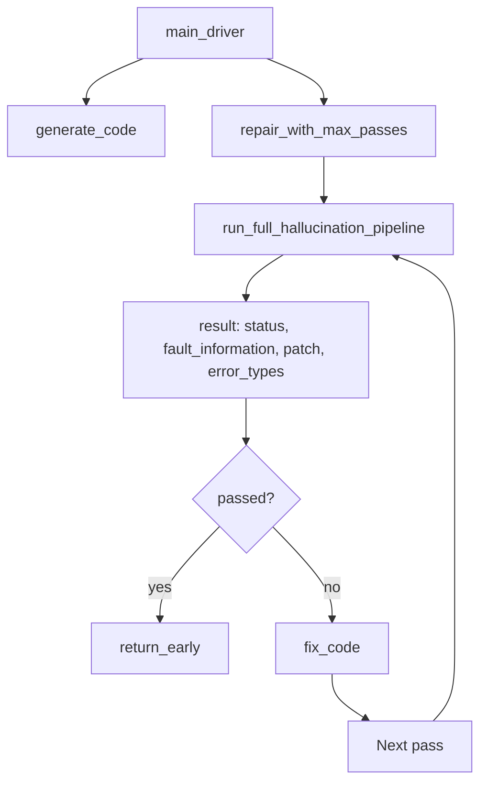

# Driver CSV Export and Step-by-Step Prints

## Goal

1. **main_driver**: Save all run results to a CSV file.
2. **Per-pass prints**: For each repair trial, print code, error, patched code, and trial count so the flow is understandable.

## Current Flow



## Implementation Plan

### 1. Add helper to summarize fault_information for display/CSV

Create a small helper (inline or in the same cell as repair_with_max_passes) to extract a concise error string from `fault_information`:

- From `ast_info.ast_errors`: type + message
- From `dynamic_info`: error_type + error_message (truncated)

Use this for both prints and CSV.

### 2. Modify repair_with_max_passes

**Location**: [PHASE_1.ipynb](PHASE_1.ipynb) – cell with `def repair_with_max_passes`

**Changes**:

- At the start of each pass (before pipeline run), print:
  - `--- TRIAL {pass_num}/{max_passes} ---`
  - `CODE (input):` + code snippet (first ~30 lines or 1500 chars)
- After `run_full_hallucination_pipeline`:
  - Print `ERROR:` + summarized error from `fault_information` (error_type, error_message)
  - Print `PATCHED CODE:` + `result["patch"]` snippet
  - Print `TRIAL COUNT: {pass_num}`
- On passed: print same trial count and a brief success line.
- Keep existing `PASS {pass_num}` and success/failure prints; make the new output consistent.

### 3. Modify main_driver

**Location**: [PHASE_1.ipynb](PHASE_1.ipynb) – cell with `def main_driver`

**Changes**:

- Add parameter: `main_driver(max_passes=3, error_type_filter=None, save_csv_path=None)`.
- Initialize `all_results = []` before the dataset loop.
- After each task, append a result row:
  - `dataset`, `task_id`, `initial_code`, `final_code`, `final_status`, `passes_used`
  - `error_summary` (from last `fault_information` if failed)
  - Optionally: `last_fault_information` as JSON string (truncated if huge) for debugging
- After the dataset loop: if `save_csv_path` is set, save `pd.DataFrame(all_results)` to CSV.
- Add a sample print after each task showing `code, error, patched code, trial count` (using the last failed pass if applicable, or final state).

**CSV columns** (suggested):

- `dataset`, `task_id`, `final_status`, `passes_used`, `initial_code`, `final_code`, `error_summary`

If needed for debugging, add `last_fault_info_json` (string, truncated).

### 4. Optional: fix_code

No new prints in `fix_code`; keep it minimal. The per-pass output in `repair_with_max_passes` is sufficient for "code, error, patched code, trial count."

## Example Output (per task, per pass)

```
--- TRIAL 1/3 ---
CODE (input):
def foo(): ...

ERROR: AssertionError - For INPUT X we get Y but need Z
PATCHED CODE:
def foo(): ... (fixed)
TRIAL COUNT: 1
```

## Files to Modify

- [PHASE_1.ipynb](PHASE_1.ipynb): Edit 2 cells (repair_with_max_passes, main_driver)
